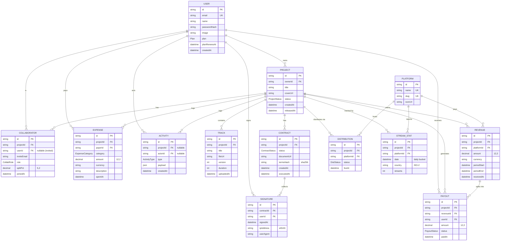

# Musiky — Entity Relationship Diagram

Visual ERD of the Musiky database (Postgres + Prisma).
Renders natively in GitHub, GitLab, and VSCode (with the Markdown Preview Mermaid extension).
For a standalone image, paste the block into <https://mermaid.live> and export as PNG/SVG/PDF.

## Enums

| Enum              | Values                                                                                                                  |
| ----------------- | ----------------------------------------------------------------------------------------------------------------------- |
| `Plan`            | `STARTER`, `PRO`, `TEAM`                                                                                                |
| `ProjectStatus`   | `DRAFT`, `READY`, `LIVE`, `ARCHIVED`                                                                                    |
| `CollabRole`      | `OWNER`, `PRODUCER`, `COMPOSER`, `VOCALIST`, `MANAGER`, `ARTIST`, `OTHER`                                               |
| `ContractStatus`  | `DRAFT`, `PENDING`, `SIGNED`, `EXECUTED`                                                                                |
| `ExpenseCategory` | `MARKETING`, `PRODUCTION`, `MASTERING`, `VIDEO`, `LEGAL`, `OTHER`                                                       |
| `DistStatus`      | `PENDING`, `LIVE`, `FAILED`, `TAKEDOWN`                                                                                 |
| `PayoutStatus`    | `PENDING`, `PAID`, `FAILED`                                                                                             |
| `ActivityType`    | `PROJECT_CREATED`, `TRACK_UPLOADED`, `COLLAB_INVITED`, `COLLAB_JOINED`, `CONTRACT_CREATED`, `CONTRACT_SIGNED`, `CONTRACT_EXECUTED`, `DISTRIBUTED`, `EXPENSE_LOGGED`, `REVENUE_RECEIVED`, `PAYOUT_SENT` |

## Cardinality Summary

- A **User** owns 0..N Projects, joins 0..N Projects as a Collaborator, signs 0..N Contracts, pays 0..N Expenses, receives 0..N Payouts.
- A **Project** has exactly 1 owner, 1..N Collaborators (one of which is the OWNER), 0..N Tracks, 0..N Contracts, 0..N Expenses, 0..N Distributions (one per Platform), 0..N Revenues, 0..N Payouts, 0..N Activities.
- A **Contract** belongs to exactly 1 Project and collects 1 Signature per signing Collaborator.
- A **Platform** is referenced by many Distributions, StreamStats and Revenues (e.g. Spotify, Apple Music, …).
- A **Revenue** event fans out into one **Payout** per Collaborator using `revenue.amount * splitPct / 100`, inside a single Postgres transaction.
- An **Activity** row records every meaningful event for the live activity feed (project created, track uploaded, contract signed, payout sent, …).
